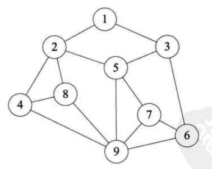
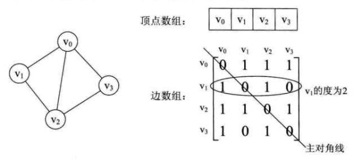
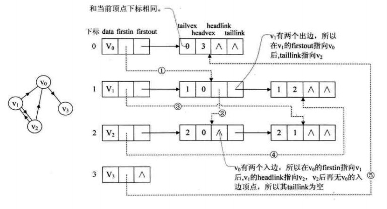
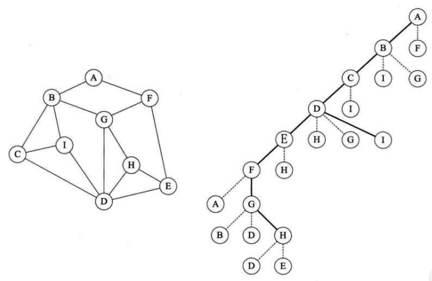
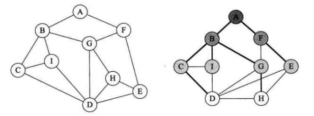
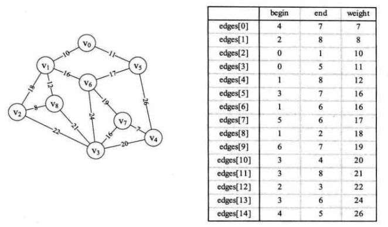
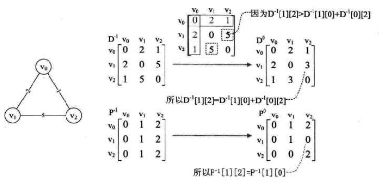

# 定义

图是由顶点的有穷非空集合和顶点之间边的集合组成，通常表示为： G(V,E)，其中，G 表示一个图，V 是图 G 中顶点的集合，E 是图 G 中边的集合。

**顶点**：指在图结构中的数据元素。

**边**：在图结构中，任意两个顶点之间都可能由关系，顶点之间的逻辑关系用边来表示。

**无向边**：若顶点 A 到顶点 B 之间的边没有方向，则称这条边为无向边。

**有向边**：若从顶点 A 到顶点 B 的边有方向，则称这条边为有向边，也称为弧。

**简单图**：在图结构中，若不存在顶点到其自身的边，且同一条边不重复出现，则称这样的图为简单图。

**无向完全图**：在无向图中，如果任意两个顶点之间都存在边，则称这样的图为无向完全图。

**权**：图的边或弧具有与它相关的数字，这种与图的边或弧相关的数字叫做权。

**网**：这种带权的图通常称为网。

**度**：顶点的度是和其相关联的边的数目。

**弧头**、**弧尾**：连结顶点 A 到 D 的弧，A 是弧尾，D 是弧头。

**出度**、**入度**：对于有向图，以该顶点为头的弧的数目称为入度，以该顶点为尾的弧的数目称为出度。

**回路**：第一个顶点到最后一个顶点相同的路径称为回路或环。

**连通图**：在无向图中，如果从顶点 A 到顶点 B 有路径，则称 A 和 B 是连通的。如果对于图中任意两个顶点 都是连通的，则称这个图是连通图。

**连通分量**：无向图中的极大连通子图称为连通分量。连通分量是一个子图。

**连通图的生成树**：连通图生成树是一个极小的连通子图，它含有图中全部的 n 个顶点，但只有足以构成一棵树的 n - 1 条边。

# 图的存储结构

图的邻接矩阵存储方式是用两个数组来表示图。一个一维数组存储图中的顶点信息，一个二维数组（称为邻接矩阵）存储图中边或弧的信息。若二维数组中某某一个值大于1，则便是对应的x，y的点连通。

如果图有 n 个顶点，则邻接矩阵是一个 n * n 的方阵。

上图是一个无向图，无向图的边数组是一个对称矩阵。

对于使用二维存储结构，可能会造成空间上的浪费，所以可以采用链表的方式来储存。

其中 adjvex 是邻接点域，存储某个顶点的邻接点在顶点表的中下标。

**十字链表法**

对于上面的接邻链表，只储存了一个值，即如果用来表示入度，则不能表示出度了。为了解决这个问题，采用十字链表，在边的接邻表中，一次存储这两个的引用。

我们重新定义顶点表结点结构，这个结构包含3个值：

1. data：存储顶点数据。
2. firstin：表示入边表头指针，指向该顶点的入边表中的第一个结点。
3. firstout：表示出边表头指针，指向该顶点的出边表中的第一个结点。

对于边表结点结构，有4个数据：

1. tailvex：指弧起点在顶点表的下标。
2. headvex：指弧终点在顶点表中的下标。
3. headlink：指入边表指针域，指向终点相同的下一条边。
4. taillink：指边表指针域，指向起点相同的下一条边。

十字链表的好处就是因为把接邻表和逆接邻表正整合在了一起，这种即容易找到以 v1 为尾的弧，也容易找到以 vi 为头的弧，容易求得顶点的出度和入度。

# 图的遍历

从图中某一顶点出发访问图中其余顶点，且使每一个顶点仅被访问一次，这一过程就叫做图地遍历。

通常由两种遍历次序方案：深度优先遍历、广度优先遍历。

**深度优先算法**

上图的左图中，是一个简单连通图，我们从点 A 开始出发，遍历整个图。

遍历法则：

1. 对于一个点，按逆时针的方向，排列与它连通的点。
2. 按照右手法则，从与它连通的点中走下一个没有走过的点。
3. 如果走到的点是起点，则退回，从连通点中走下一个没有走过的点。
4. 如果一直退回到起点，则遍历结束。

深度优先遍历，其实就是一个递归的过程，对照上图中的右图，发现这个步骤就像树的前序遍历。

对于非连通图，在经过上述遍历后，在选择下一个没有访问过的点作为起点，重复上述遍历步骤即可。

**广度优先算法**

上图的左图是原简单，我们需要做一些变形，变形原则是：

将起点放置在最上第一层，让与它有边的顶点作为第二层，再让与第二层有边的作为第三层，以此类推。

遍历的过程类似于树的层序遍历。

# 最小生成树

对于一个网结构，我们把构造连通图的最小代价的生成树称为最小生成树。

**普利姆算法**

适用于边较多的情况。

**克鲁斯卡尔算法**

以某顶点为起点，逐步找各个顶点上的最小权值来构建最小生成树。适用于边较少的情况。

 其中 begin 为起点（或者说是下标小的点），end 是终点。对于左侧的网结构，我们构建如右侧所示的边集数组结构。并根据权重由小到大排列。

在列表中依次选择代价最小的边，若该边依附的顶点落在图中不同的连通分量上（即加入该边，不会出现回环），则将此边加入到树中，否则舍去此边，选择下一条代价最小的边。依次类推，直至所有顶点都在同一连通分量上为止。

# 最短路径

**迪捷斯特拉算法**

 

如上图，要求v0 - v8 之间的最短距离，我们可以从 v0 开始看，v0 和 v1 、v2 相连， v0 到 v1 之间的最短距离一眼可以看出是1。然后 v1 与 v2、v3、v4相连，依次可求出v0 到这三个点之间的距离。然后回来看 v0 - v2 的路径，是5，对比v0 - v1 - v2 的距离要长，所以可得到 v0 - v2 之间的最短距离。然后查看与 v2 相邻的点。

照上面的步骤循环，就可以得到 v0 - v8 之间的最短距离。

**弗洛伊德算法**

一、初始化：D-1矩阵，其中的值为点之间的距离(同一点为0，不相连点为最大值)，P-1矩阵为点的前置矩阵，就是到达该点之前要经过的点。(初始化左到右为0-n，同一列值相同)

二、遍历：从 v0 出发，计算与其相连的点的最短距离，这里 v0 没有变化。v1 - v2 的距离一开始直接相连为5，但是 v1 先经过 v0 再到 v2 更短，为3。则更新D-1表，更新其中 v1 - v2 的距离为3得到D0表。更新P-1表，v1 - v2 的前置点换为 点 v0 ，并得到P0表。

最后将这两个矩算完后，可以通过前置矩阵查询D表，就可得到两点之间的最短距离。

这就是算法的基本思想，对于更复杂的图，则矩阵的行列更多，算法相同。

