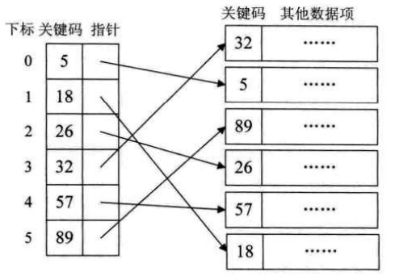
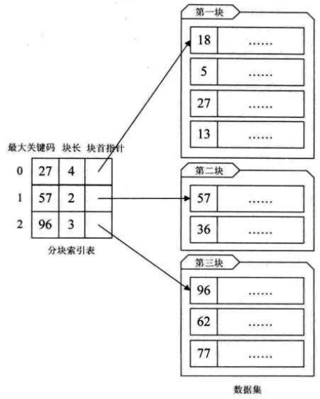
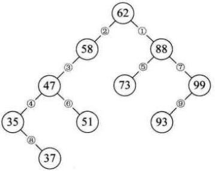
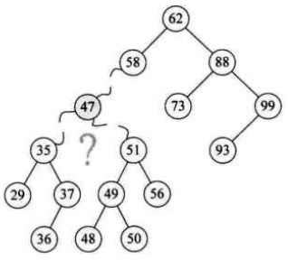
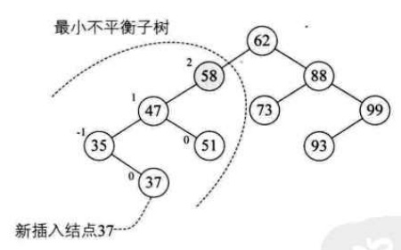
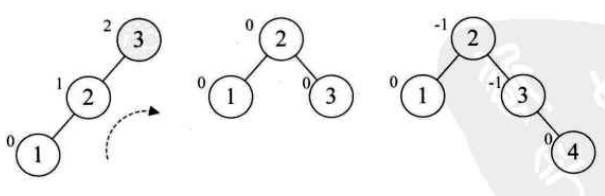
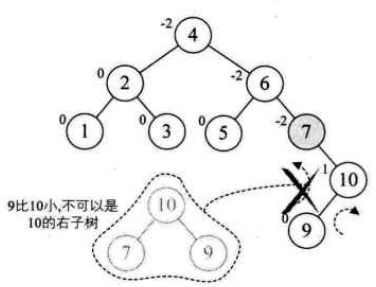
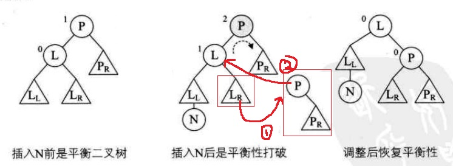

# 查找概论

查找就是根据给定的某个值，在查找表种确定一个其关键字等于给定值的数据元素。

**查找表**

查找表是由同一类型的数据元素构成的集合。

**关键字**

关键字是数据元素种某个数据项的值，又称为键值，可以用来标识一个数据元素。

若此关键字可以唯一地标识一个记录，则称为主关键字。

对于那些可以识别多个数据元素的关键字，称为次关键字。

查找表按照操作方式来分有两大种：

**静态查找表**：只作查找操作的查找表。

**动态查找表**：在查找过程中同时插入查找表种不存在的数据元素，或者从查找表种删除已经存在的某个数据元素。

# 顺序查找

顺序查找又叫线性查找，它的查找过程是：从表中第一个（或者最后一个）开始，逐个进行记录的关键字和给定的值比较，若某个记录的关键字和给定的值相等，则查找成功，找到所查的记录；如果直到最后一个（或第一个）记录，其关键字和给定的值比较都不等时，则表中没有所查的记录，查找失败。

给一个简单的查找实现：

```c++
int SequentialSearch(int *a,int n,int key) 
{
    int i;
    for(i=1;i<=n;i++)
    {
    	if(a[i]==key)
            return i;
    }
    return 0;
}
```

对于上面的代码，除了对 a[i] 进行比较外，还需要对 i 进行越界检查。我们可以设置一个哨兵，节省对 i 的比较。

```c++
int SequentialSearch2(int *a,int n,int key)
{
    int i;
    // 直接设置a[0]为关键值
    a[0] = key;
    i = n;
    while(a[i] != key) {
        i--;
    }
    return i;
}
```

这种在查找方向的尽头放置"哨兵"，在总数据较多时，效率还是有很大提高的。

显然，顺序查找技术有很大缺点，当总数很大时，查找效率极为低下。但是算法非常简单，适合在数据不多的情况下使用。

# 有序表查找

**折半查找**

折半查找，又称为二分查找。他的前提是线性表种的记录必须是关键码有序（通常从小到大有序），线性表必须才采用顺序存储。

折半查找的基本思想是：在有序表种，取中间记录作为比较对象，若给定值与中间记录的关键字相等，则查找成功；若给定值小于中间记录的关键字，则在中间记录的左半区继续查找，若给定值大于中间记录的关键字，则在中间记录的又半区继续查找。不断重复上述过程，直到查找成功，或所有查找区域无记录，则查找失败。

```c++
int BinarySearch(int *a,int n,int key) 
{
    int low,high,mid;
	// 定义最低下标为记录首位
    low = 1;
    // 定义最高下标为记录末玩位
    high = n;
    while(low <= high)
    {
        // 折半
        mid = (low + high) / 2;
        // 若查找值比中值小，调整最高下标到中位小一位
        if(key < a[mid])
            high = mid - 1;
        // 若查找值比中值大，调整最低下标到中位大一位
        else if(key > a[mid])
            low = mid + 1;
        // 相等则说明中位即为查找到的位置
        else
            return mid;
    }
    return 0;
}
```

折半算法的时间复杂度为 O(logn)。折半查找算法的前提条件是需要有序表顺序存储，对于静态查找表，一次排序后不再变化，这样的算法已经比较好了。但是对于需要频繁执行插入或删除操作的数据集来说，维护有序的排序会带来不小的工作量，那就不建议使用。

**插值查找**

相比于折半查找，我们可以考虑不一定一次要折半，而是一次确定更精确的比例。如在英文词典里找 "apple"，我们会更倾向于找前面一部分，而不是从中间开始找。

插值查找是根据要查找的关键字 key 与 查找表种最大最小记录的关键字比较后的查找算法，其核心在于插值计算公式：

**( key - a[low] ) / ( a[high] - a[low] )**

从时间复杂度来说，插值查找也是 O(long)，但对于表长较大，关键字分布比较均匀的查找表来说，插值查找算法的平均性能比折半查找要好得多。但是对于数据分布不均匀的，插值插值算法效率就不是很好了。

# 线性索引查找

在数据变化非常频繁的情况下，如果要一直保证记录全部都是按照当中某个关键字有序，需要花费的代价是非常高昂的。那么，我们可以尝试不要求原始记录有序排列，采用其他方式保证能够迅速查找。

数据结构的最终目的是提高数据的处理速度，索引是为了加快查找速度而设计的一种数据结构。

索引按照结构可以分为线性索引、树形索引和多级索引。

线性索引就是将索引项集合组织为线性结构，也称为索引表。线性索引中有三种类型：稠密索引、分块索引和倒排索引。

**稠密索引**

稠密索引是指在线性索引中，将数据集中的每个记录对应一个索引项。



对比于右侧杂乱的数据，从中取出一个关键码，组成左侧一个新的数组，这样可以针对左侧数据进行排序，然后通过折半查找提高效率。

上面是稠密索引的有点，但是如果数据集非常大，则意味着索引表也得同样的数据集长度，这也会消耗大量内存，这则是它的劣势。

**分块索引**

相比于稠密索引，分块索引不对每个记录都进行标记，二十将数据集进行分块，使其分块有序，然后再对每一块建立一个索引项，从而减少索引项的个数。

分块有序，是把数据集的记录分成了若干块，并且这些块需要满足两个条件：

1. 块内无序。
2. 块间有序。

如下图，我们定义的分块索引项结构分三个数据项：

+ 最大关键码，它存储每一块中的最大关键字，这样可以操作下一块中的最小关键字也能比这一块的最大关键字要大，便于后面的查找。
+ 存储了块中的记录个数，方便循环遍历操作。
+ 用于指向块首元素的指针，便于开始对这一块中的记录进行遍历。



总的来说，分块索引在兼顾了对细分块不需要有序的情况下，大大增加了整体查找的速度，所以普遍被用于数据库表查找等技术应用中。

**倒排索引**

在搜索引擎中，无论我们查找什么样的信息，它都可以在极短的时间内给我们返回相关的结果，这里面有一种最基础的搜索技术：倒排索引。

如我们有几遍文章，我们先拆分文章中的单词，然后根据以单词为key，记录这个单词在哪篇文章中。这样用户在输入关键字时，就可以迅速返回文章列表。

这种索引表中的每一项都包括一个属性值和具有该属性值的记录地址，由于不是由记录来确定属性值，而是由属性值来确定记录的位置，因而称为倒排索引。

# 二叉排序树

为了保证在数据插入和删除时效率不错，又可以比较高效的实现查找的算法。可以将数据构建成二叉树结构。

**二叉排序树插入操作**

如：我们有个无序数据集合 { 62,88,58,47,35,73,51,99,37,93 }。  
将第一个数据 62 作为根，  
然后读取下一个数据 88 ，比 62 小，则放入右侧，  
然后读取下一个数据 58，比 62 小，则放入左子树，  
以此循环，对比父节点，小于的放左子树，大于的放右子树。



这样我们就可以得到一个二叉树，而且我们对它使用中序遍历时，就可以得到一个有序的集合，所以我们通常称它为二叉排序树。

二叉排序树，又称为二叉查找树。它或者时一颗空树，或者时具有下列性质的二叉树：

+ 若它的左子树不空，则左子树上的所有结点的值均小于它的根结点的值。
+ 若它的右子树不空，则右子树上的所有结点的值均大于它的根结点的值。
+ 它的左、右子树也分别为二叉排序树。

**二叉排序树查找操作**

从根结点出发，与查找的值 key 比较，如果 key 大于结点的值，则寻找该结点的右子结点，反之则找左子结点。根据这个规律递归，则可以找到目标值，或则该集合中无查找值。

**二叉排序树删除操作**



如上图，如果要删除 47 这个结点，我们可以对该结点进行中序遍历。找到该结点的直接前驱（或直接后继）结点 s，将这两个结点的值进行交换 ，然后再删除结点 s 即可。

二叉排序树是以链接的方式存储，保持了链接存储结构再执行擦插入或删除操作时不用移动元素的优点，增删的时间性能好。

而在查找方面，查找的时间效率取决于树构成的形状，在极端情况下，该树为左斜树或右斜树，那效率就很低了。为了不让二叉排序树成为这种情况，我们需要对树进行平衡。

# 平衡二叉树

平衡二叉树，是一种二叉排序树，其中每一个节点的左子树和右子树的高度差至多为1。它的左子树和右子树都是平衡二叉树，将二叉树上结点的左子树深度减去右子树深度的值称为平衡因子BF。

距离插入结点最近的，且平衡因子的绝对值大于 1 的结点为根的子树，我们称为最小不平衡子树。



如上图，当插入结点 37 时，结点 58 的左子树高度为2，右子树为空，高度为 0 ，则他们的高度差大于1。即结点 58 为根的子树为最小不平衡子树。

**平衡二叉树实现原理**

平衡二叉树构建的基本思想就是在构建二叉排序树的过程中，每当插入一个结点时，先检查是否因插入而破坏了树的平衡性，若是，则找出最小不平衡子树。在保持二叉排序树特性的前提下，调整最小不平衡子树各结点之间的链接关系，进行相应的旋转，使之成为新的平衡子树。

如：我们有数组 a[10] = { 3,2,1,4,5,6,7,10,9,8 }，我们先正常一个二叉排序树。



当添加到 1 结点时，发现 3 结点不平衡了，平衡因子为正，则对该最小不平衡子树进行右旋。然后得到中间的平衡树，就可以继续添加结点了。



当添加到结点 9 时，也出现了不平衡的情况，如果我们知识简单地对以结点7为最小不平衡子树进行左旋，得到的结构却不符合二叉排序树的规则，则我们可以先对其子树进行旋转，使结点 7 和结点 10 的平衡因子正负相同，然后在对结点 7 进行旋转。

**旋转操作**



如上图，其中三角代表一个子树。以右旋为例，旋转的操作就是把 Lr 子树变成 P 结点的左子树，然后将 P 子树变成 L 的右子树。左旋就是对称的相反操作。

