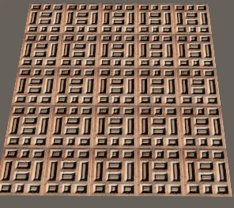

```c++

Shader "URP/BaseTex"
{
    Properties
    {
        [MainTexture] _BaseMap("Albedo", 2D) = "white" {}
        [MainColor] _BaseColor("Color", Color) = (1,1,1,1)
    }
    SubShader
    {
        Tags{"RenderType" = "Opaque"}

        Pass
        {
            HLSLPROGRAM

            #pragma vertex vert
            #pragma fragment frag

            #include "Packages/com.unity.render-pipelines.universal/ShaderLibrary/Core.hlsl"
            #include "Packages/com.unity.render-pipelines.universal/ShaderLibrary/Lighting.hlsl"

            TEXTURE2D(_BaseMap);
            SAMPLER(sampler_BaseMap);

            CBUFFER_START(UnityPerMaterial)
            float4 _BaseMap_ST;
            half4 _BaseColor;
            CBUFFER_END

            struct Attributes
            {
                float4 positionOS               : POSITION;
                float2 texcoord                 : TEXCOORD0;
                UNITY_VERTEX_INPUT_INSTANCE_ID
            };

            struct Varyings 
            {
                float4 positionCS               : SV_POSITION;
                float2 uv                       : TEXCOORD0;
                UNITY_VERTEX_INPUT_INSTANCE_ID
            };

            Varyings vert(Attributes input)
            {
                Varyings output = (Varyings)0;
                UNITY_SETUP_INSTANCE_ID(input);
                UNITY_TRANSFER_INSTANCE_ID(input, output);

                VertexPositionInputs vertexInput = GetVertexPositionInputs(input.positionOS.xyz);

                output.positionCS = vertexInput.positionCS;
                
                output.uv = TRANSFORM_TEX(input.texcoord, _BaseMap);

                return output;
            }

            half4 frag(Varyings input) : SV_Target
            {
                UNITY_SETUP_INSTANCE_ID(input);
                
                half4 col = SAMPLE_TEXTURE2D(_BaseMap, sampler_BaseMap, input.uv);
                
                col *= _BaseColor;

                return col;
            }

            ENDHLSL
        }
    }
    FallBack "Specular"
}

```