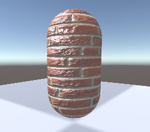

# 法线贴图为什么是蓝色的：

因为法线贴图存储的是一个模型在切线空间下的方向，而切线空间的法线方向都是总体围绕z方向偏移的，如正z（0，0，1），稍微偏移（0.1，0.4，1）等，可见数据基本都是蓝色的。

# 什么是切线空间：

模型的每个顶点都有自己的切线空间，该切线空间的坐标轴原点为顶点的坐标，坐标轴的z轴为该顶点的法线，坐标轴的x轴为该顶点的切线，坐标轴的y轴为副切线。（注意xy轴可不是随意的哦，xy轴正方向等于uv的正方向，这属于法线贴图的生成原理了，法线贴图制作完了毕竟还是要通过uv来采样嘛）。

# 为什么法线贴图要存储切线空间下的法线方向：

法线贴图也可以存储模型空间或者世界空间（两者差不多，只不过前者transform归0了）中的法线方向，这样只需要传uv就可以直接采样出法线方向，计算简单方便，但是也有致命缺点，就是这种法线贴图存储的是特定transform下的方向，烘培好后，这个模型就不能旋转了，一旋转法线方向全变了，对于骨骼模型来说各顶点不旋转是不可能的，所以模型或世界空间中的法线贴图作用有限。而基于切线空间中的法线贴图，烘培好后模型依然可以随意变换。前面说到切线空间的法线贴图偏蓝色，那模型空间或世界空间中的法线贴图什么颜色呢？大概是红绿蓝色的，可以理解为平时写shader ps输出法线后的那种颜色即世界空间中的法线贴图颜色。

# 法线贴图的采样：

上面2中谈到法线贴图是根据uv来采样的，采样出来的法线方向是基于切线空间的。在光照计算时，需要统一光的方向与法线方向，既可以统一到切线空间中计算，也可以统一到世界空间中计算。从性能角度讲，如果光源较多则建议ps中用TBN将法线变换到世界空间中算（因为只需转一次法线即可），反之建议在vs中将光照方向用TBN的转置变换到切线空间中然后插值到ps中与采样出的法线直接计算。

# 法线贴图的压缩：

法线贴图存储的是三维的法线方向，那么可以用二维来表示三维吗？这样就可以用rg通道来存储法线了？当然是可以的！前提：未压缩的法线贴图存储的是归一化的向量xyz，且切线空间下z不可能为负数。有这两个前提，那压缩的法线贴图虽然只存xy就可以反推出z的。



```c++

Shader "URP/NormalMap"
{
    Properties
    {
        [MainTexture] _BaseMap("Albedo", 2D) = "white" {}
        [MainColor] _BaseColor("Color", Color) = (1,1,1,1)
        _SpecularColor("SpecColor", Color) = (1,1,1,1)
        _Gloss("Gloss", Range(20, 100)) = 20
        _NormalScale("Normal Scale", Range(-1, 1)) = 1.0
        _NormalMap("Normal Map", 2D) = "bump" {}
    }
    SubShader
    {
        Tags{"RenderType" = "Opaque"}

        Pass
        {
            HLSLPROGRAM

            #pragma vertex vert
            #pragma fragment frag

            #include "Packages/com.unity.render-pipelines.universal/ShaderLibrary/Core.hlsl"
            #include "Packages/com.unity.render-pipelines.universal/ShaderLibrary/Lighting.hlsl"

            TEXTURE2D(_BaseMap);
            SAMPLER(sampler_BaseMap);

            TEXTURE2D(_NormalMap);
            SAMPLER(sampler_NormalMap);

            CBUFFER_START(UnityPerMaterial)
            float4 _BaseMap_ST;
            float4 _NormalMap_ST;
            half _NormalScale;
            half4 _BaseColor;
            float4 _SpecularColor;
            half _Gloss;
            CBUFFER_END

            struct Attributes
            {
                float4 positionOS               : POSITION;
                float3 normalOS                 : NORMAL;
                float4 tangentOS                : TANGENT;
                float2 texcoord                 : TEXCOORD0;
                UNITY_VERTEX_INPUT_INSTANCE_ID
            };

            struct Varyings 
            {
                float4 positionCS               : SV_POSITION;
                float2 uv                       : TEXCOORD0;
                float3 positionWS               : TEXCOORD1;
                half3 normalWS                  : TEXCOORD2;
                half3 tangentWS                 : TEXCOORD3;
                half3 bitangentWS               : TEXCOORD4;
                UNITY_VERTEX_INPUT_INSTANCE_ID
            };

            Varyings vert(Attributes input)
            {
                Varyings output = (Varyings)0;
                UNITY_SETUP_INSTANCE_ID(input);
                UNITY_TRANSFER_INSTANCE_ID(input, output);
                
                VertexPositionInputs vertexInput = GetVertexPositionInputs(input.positionOS.xyz);
                VertexNormalInputs normalInput = GetVertexNormalInputs(input.normalOS, input.tangentOS);

                output.positionCS = vertexInput.positionCS;
                output.positionWS = vertexInput.positionWS;
                output.normalWS = normalInput.normalWS;
                output.tangentWS = normalInput.tangentWS;
                output.bitangentWS = normalInput.bitangentWS;

                output.uv = TRANSFORM_TEX(input.texcoord, _BaseMap);

                return output;
            }

            half4 frag(Varyings input) : SV_Target
            {
                UNITY_SETUP_INSTANCE_ID(input);
                
                half3 ambient = unity_AmbientSky.rgb;
                
                float2 uv = input.uv;
                half3 normalTS = UnpackNormalScale(SAMPLE_TEXTURE2D(_NormalMap, sampler_NormalMap, uv), _NormalScale);
                half3 normalWS = TransformTangentToWorld(normalTS, half3x3(input.tangentWS, input.bitangentWS, input.normalWS));

                float3 positionWS = input.positionWS;
                float3 lightDirWS = normalize(_MainLightPosition.xyz);

                float3 albedo = SAMPLE_TEXTURE2D(_BaseMap, sampler_BaseMap, uv) * _BaseColor;
                // 计算漫反射
                float3 diffuseValue = saturate(dot(normalWS , lightDirWS));
                // 提高暗部亮度
                diffuseValue = clamp(diffuseValue, 0.15, 1);
                half3 diffuse = albedo * _MainLightColor.rgb * diffuseValue;

                // 计算高光反射
                float3 viewDirWS = normalize(_WorldSpaceCameraPos.xyz - positionWS);

                // 视线方向与反射方向的接近程度 近似 半程方向与法线方向的接近程度
                // 半程向量
                float3 halfWS = normalize(lightDirWS + viewDirWS);

                half3 specular = _MainLightColor.rgb * _SpecularColor * (pow(saturate(dot(halfWS, normalWS)), _Gloss));

                half4 col = half4(ambient + diffuse + specular, 1.0);
                
                return col;
            }

            ENDHLSL
        }
    }
    FallBack "Specular"
}

```