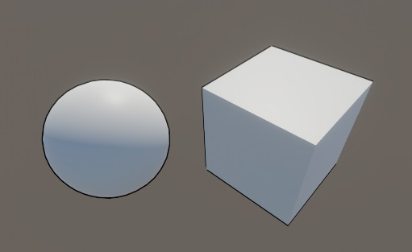

```c++
Shader "URP/Outline" 
{
	Properties 
    {
		_OutlineColor ("Outline Color", Color) = (0, 0, 0, 1)
        _OutlineWidth ("Outline Width", Range(1, 10)) = 1
	}

	SubShader 
    {

		Tags { "RenderType"="Opaque" "Queue"="Geometry"}
		
		Pass 
        { 
            Cull Front

			HLSLPROGRAM
			
			#pragma vertex vert
			#pragma fragment frag

            #include "Packages/com.unity.render-pipelines.universal/ShaderLibrary/Core.hlsl"

            CBUFFER_START(UnityPerMaterial)
			half4 _OutlineColor;
			half _OutlineWidth;
            CBUFFER_END
			
            struct Attributes
            {
                float4 positionOS               : POSITION;
                float3 normalOS                 : NORMAL;
                UNITY_VERTEX_INPUT_INSTANCE_ID
            };

            struct Varyings 
            {
                float4 positionCS               : SV_POSITION;
                UNITY_VERTEX_INPUT_INSTANCE_ID
            };

            Varyings vert(Attributes input)
            {
                Varyings output = (Varyings)0;
                UNITY_SETUP_INSTANCE_ID(input);
                UNITY_TRANSFER_INSTANCE_ID(input, output);

                VertexPositionInputs vertexInput = GetVertexPositionInputs(input.positionOS.xyz);

                float4 positionCS = vertexInput.positionCS;
                float3 normalCS = mul((float3x3) UNITY_MATRIX_VP, mul((float3x3) UNITY_MATRIX_M, input.normalOS));
                
                // 裁剪空间只有xy有效
                // 投影变换后是将xy除以w分量的，这里需要乘上w
                // 屏幕宽高不是1：1时，描边会拉伸，这里需要除以屏幕尺寸达到描边xy相同
                positionCS.xy += normalize(normalCS.xy) * _OutlineWidth * positionCS.w / _ScreenParams.xy;
                
                output.positionCS = positionCS;

                return output;
            }

			half4 frag(Varyings input) : SV_Target {

                UNITY_SETUP_INSTANCE_ID(input);
				
				return _OutlineColor;
			}
			
			ENDHLSL
		}
	}
}

```