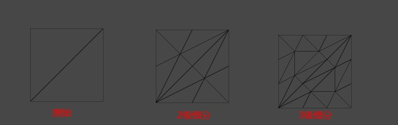

# 曲线细分

参考文章：

[曲面细分着色器 -CSDN](https://blog.csdn.net/u013746357/article/details/107495352)

[视察贴图 -知乎](https://www.jianshu.com/p/fea6c9fc610f)



```c++
Shader "URP/Tessellation"
{
    Properties
    {
		_Tessellation("Tessellation", Range(1, 32)) = 4
    }
    SubShader
    {
        Tags{"RenderType" = "Opaque"}

        Pass
        {
            HLSLPROGRAM

            #pragma hull HS
            #pragma domain DS 
		    #pragma target 4.6
            #pragma vertex vert
            #pragma fragment frag

            #include "Packages/com.unity.render-pipelines.universal/ShaderLibrary/Core.hlsl"

            CBUFFER_START(UnityPerMaterial)
            half _Tessellation;
            CBUFFER_END
            
            struct Attributes
            {
                float4 positionOS               : POSITION;
                UNITY_VERTEX_INPUT_INSTANCE_ID
            };

            struct Varyings 
            {
                float4 positionCS               : SV_POSITION;
                UNITY_VERTEX_INPUT_INSTANCE_ID
            };

            struct PatchTess
            {
                float EdgeTess[3]               : SV_TessFactor;
                float InsideTess                : SV_InsideTessFactor;
            };

            PatchTess ConstantHS(InputPatch<Attributes, 3> patchs, int patchID : SV_PrimitiveID)
            {
                PatchTess pt;
                pt.EdgeTess[0] = _Tessellation;
                pt.EdgeTess[1] = _Tessellation;
                pt.EdgeTess[2] = _Tessellation;
                pt.InsideTess = _Tessellation;
                return pt;
            }
            
            [domain("tri")]
            [partitioning("integer")]
            [outputtopology("triangle_cw")]
            [outputcontrolpoints(3)]
            [patchconstantfunc("ConstantHS")]
            [maxtessfactor(32.0f)]
            Attributes HS(InputPatch<Attributes, 3> patchs, int i : SV_OutputControlPointID)
            {
                return patchs[i];
            }

            [domain("tri")]
            Varyings DS(PatchTess patchTess, float3 baryCoords : SV_DomainLocation, const OutputPatch<Attributes, 3> triangles)
            {       
                Varyings output = (Varyings)0;
                UNITY_SETUP_INSTANCE_ID(input);
                UNITY_TRANSFER_INSTANCE_ID(input, output);

                // baryCoords 是三角形的重心坐标
                float3 positionOS = triangles[0].positionOS * baryCoords.x + triangles[1].positionOS * baryCoords.y + triangles[2].positionOS * baryCoords.z;
                
                VertexPositionInputs vertexInput = GetVertexPositionInputs(positionOS);
                output.positionCS = vertexInput.positionCS;

                return output;
            }

            Attributes vert(Attributes input)
            {
                return input;
            }

            half4 frag(Varyings input) : SV_Target
            {
                UNITY_SETUP_INSTANCE_ID(input);
                return (half4)1;
            }

            ENDHLSL
        }
    }
    FallBack "Specular"
}
```