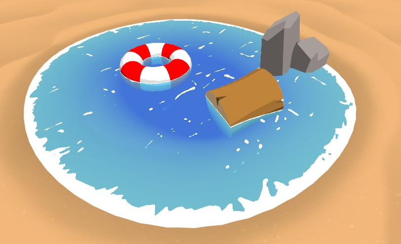

```c++
Shader "Roystan/Toon/Water"
{
    Properties
    {	
        _SurfaceNoise("Surface Noise", 2D) = "white" {}
        _DepthGradientShallow("Depth Gradient Shallow", Color) = (0.325, 0.807, 0.971, 0.725)
        _DepthGradientDeep("Depth Gradient Deep", Color) = (0.086, 0.407, 1, 0.749)
        _DepthMaxDistance("Depth Maximum Distance", Float) = 1
        _SurfaceNoiseCutoff("Surface Noise Cutoff", Range(0, 1)) = 0.777
        // 岸阈值
        _FoamDistance("Foam Distance", Float) = 0.05
        // 水面移动速度
        _SurfaceNoiseScroll("Surface Noise Scroll Amount", Vector) = (0.03, 0.03, 0, 0)
        // 模拟波浪
        _SurfaceDistortion("Surface Distortion", 2D) = "white" {}	
        _SurfaceDistortionAmount("Surface Distortion Amount", Range(0, 1)) = 0.27
        // 水波颜色
        _FoamColor("Foam Color", Color) = (1,1,1,1)
    }
    SubShader
    {
        Pass
        {

            Tags 
            {
                "Queue" = "Transparent"
            }

            Blend SrcAlpha OneMinusSrcAlpha
            ZWrite Off

			CGPROGRAM
            #define SMOOTHSTEP_AA 0.01

            #pragma vertex vert
            #pragma fragment frag

            #include "UnityCG.cginc"

            float4 _FoamColor;

            sampler2D _SurfaceDistortion;
            float4 _SurfaceDistortion_ST;

            float _SurfaceDistortionAmount;

            float2 _SurfaceNoiseScroll;

            float4 _DepthGradientShallow;
            float4 _DepthGradientDeep;

            float _DepthMaxDistance;
            float _SurfaceNoiseCutoff;

            sampler2D _CameraDepthTexture;
            sampler2D _SurfaceNoise;
            float4 _SurfaceNoise_ST;

            float _FoamDistance;

            struct appdata
            {
                float4 vertex : POSITION;
                float4 uv : TEXCOORD0;
            };

            struct v2f
            {
                float4 vertex : SV_POSITION;
                float2 noiseUV : TEXCOORD0;
                float2 distortUV : TEXCOORD1;
                float4 screenPosition : TEXCOORD2;
            };

            v2f vert (appdata v)
            {
                v2f o;
                o.distortUV = TRANSFORM_TEX(v.uv, _SurfaceDistortion);
                o.noiseUV = TRANSFORM_TEX(v.uv, _SurfaceNoise);
                o.vertex = UnityObjectToClipPos(v.vertex);
                o.screenPosition = ComputeScreenPos(o.vertex);
                return o;
            }

            float4 frag (v2f i) : SV_Target
            {
                float existingDepth01 = tex2Dproj(_CameraDepthTexture, UNITY_PROJ_COORD(i.screenPosition)).r;
                float existingDepthLinear = LinearEyeDepth(existingDepth01);

                // i.screenPosition.w 点到相机的距离
                float depthDifference = existingDepthLinear - i.screenPosition.w;

                float waterDepthDifference01 = saturate(depthDifference / _DepthMaxDistance);
                float4 waterColor = lerp(_DepthGradientShallow, _DepthGradientDeep, waterDepthDifference01);

                float foamDepthDifference01 = saturate(depthDifference / _FoamDistance);
                float surfaceNoiseCutoff = foamDepthDifference01 * _SurfaceNoiseCutoff;

                // 颜色的采样得的值在0~1，为了得到波浪起伏的效果（-1~1）,这里进行 * 2 - 1 的操作
                float2 distortSample = (tex2D(_SurfaceDistortion, i.distortUV).xy * 2 - 1) * _SurfaceDistortionAmount;
                float2 noiseUV = float2(i.noiseUV.x + _Time.y * _SurfaceNoiseScroll.x + distortSample.x, 
                                        i.noiseUV.y + _Time.y * _SurfaceNoiseScroll.y + distortSample.y);

                float surfaceNoiseSample = tex2D(_SurfaceNoise, noiseUV).r;
                float surfaceNoise = smoothstep(surfaceNoiseCutoff - SMOOTHSTEP_AA, surfaceNoiseCutoff + SMOOTHSTEP_AA, surfaceNoiseSample);

                surfaceNoise *= _FoamColor;

                return waterColor + surfaceNoise;
            }
            ENDCG
        }
    }
}
```